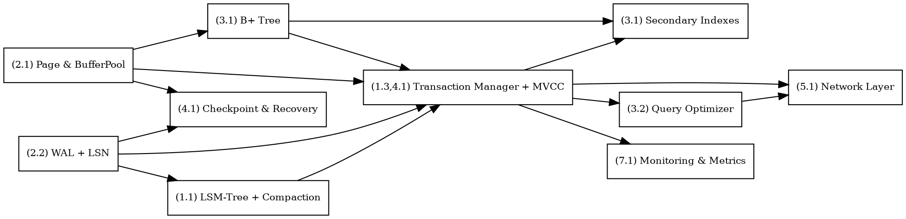

# Rust Database Engine Development Workflow

## Phase 1: Foundation & Architecture Design

### (1.1) Core Architecture
- LSM-Tree (for write-heavy)
- B+ Tree (for read-heavy/range queries)
- Hybrid approach (LSM + B+ compaction)

### (1.2) Memory Management
- Arena allocation
- Object pooling
- Memory-mapped files (mmap)
- NUMA-aware allocation
- Jemalloc/Mimalloc allocator

### (1.3) Concurrency Model
- Lock-free data structures (CAS, atomics)
- RCU (read-copy-update)
- Sharding/Partitioning
- Tokio async runtime
- Work-stealing thread pools
- MVCC (Multi-Version Concurrency Control)

---

## Phase 2: Storage Layer Implementation

### (2.1) Page Management
- Fixed-size pages (4KB–16KB)
- Buffer pool with LRU/LFU eviction
- Dirty page tracking
- Page compression (LZ4/Snappy/Zstd)

### (2.2) Write-Ahead Logging (WAL)
- Group commit batching
- Async WAL writes + periodic fsync
- WAL compression
- Parallel WAL writing
- WAL segmentation

### (2.3) Storage Formats
- Cap'n Proto / Protobuf for schema evolution
- Custom binary format for hot paths
- Columnar storage (analytics)
- Delta compression (temporal data)

---

## Phase 3: Indexing & Query Processing

### (3.1) Index Structures
- Primary: B+ Tree
- Secondary: Hash index
- Bitmap indexes
- Bloom filters
- Skip lists

### (3.2) Query Optimization
- Vectorized execution
- Code generation (JIT for hot queries)
- Cost-based optimizer with stats
- Predicate pushdown
- Index-only scans

---

## Phase 4: Transaction Management

### (4.1) ACID Implementation
- Atomicity → Undo logs
- Consistency → Constraint checks
- Isolation → MVCC, Snapshot Isolation
- Durability → WAL + Checkpointing

### (4.2) Lock Management
- Intention locks (hierarchical)
- Row-level locks
- Deadlock detection/resolution
- Lock-free algorithms (preferred where possible)

---

## Phase 5: Network & Protocol Layer

### (5.1) Network Architecture
- Async I/O (epoll/kqueue, Tokio)
- TCP_NODELAY + SO_REUSEPORT
- Custom binary protocol

### (5.2) Client Connection Management
- Connection multiplexing
- Prepared statement caching
- Result set streaming
- Network compression

---

## Phase 6: Performance Optimization

### (6.1) CPU Optimization
- Branch prediction-aware code
- SIMD instructions
- Cache-friendly layouts (SoA/AoS)
- Avoid false sharing
- Profiling (Criterion, perf, flamegraph)

### (6.2) Memory Optimization
- Eliminate padding
- Prefetching
- Huge pages
- Bandwidth-efficient access

### (6.3) I/O Optimization
- Direct I/O (O_DIRECT)
- io_uring (Linux async I/O)
- Read-ahead
- Write coalescing
- SSD-optimized patterns

---

## Phase 7: Monitoring & Observability

### (7.1) Metrics Collection
- Latency (p95, p99)
- Throughput (TPS, QPS)
- Cache hit ratio
- Resource utilization (CPU, memory, disk)

### (7.2) Logging & Debugging
- Structured logging (JSON)
- Async log writes
- Log filtering (levels)
- Distributed tracing

---

## Phase 8: Testing & Benchmarking

### (8.1) Testing
- Unit + integration tests
- Property-based tests (QuickCheck)
- Fuzzing
- Stress/load testing
- Chaos testing

### (8.2) Benchmarking
- YCSB for key-value
- TPC-C (OLTP)
- TPC-H (OLAP)
- Custom microbenchmarks

---

## Phase 9: Advanced Features

### (9.1) Replication & HA
- Streaming replication
- Logical replication
- Multi-master with conflict resolution
- Consensus (Raft/Paxos/PBFT)

### (9.2) Partitioning & Sharding
- Range partitioning
- Hash partitioning
- Consistent hashing
- Composite strategies


---

# Dependency-aware Build Plan

This document is the **dependency-first, engineering-actionable plan** for the Rust database engine. It preserves the *critical path*, surfaces highest cognitive-load components, and provides **visual step-by-step relation graphs** (Mermaid + DOT) that you can drop into docs or CI.

---

## Contents

1. Critical components (highest cognitive load)
2. Dependency graph (visual: Mermaid + DOT)
3. Step-by-step relation (minimal viable critical path)
4. Detailed dependency mapping (nodes → prerequisites → needed-by)
5. Parallelizable workstreams
6. Gating milestones
7. Risk map & mitigations
8. Practical implementation order (numbered steps)
9. Testing & CI checklist
10. Next actions

---

## 1. Critical components (highest cognitive load)

These subsystems are on the *critical path* and require the most coordination and tests:

1. **(2.2) WAL & LSN system**
2. **(2.1) Page / Buffer pool + Page cache**
3. **(4.1) Checkpoint & Recovery / Crash recovery**
4. **(1.1, 3.1) Storage index core: B+ Tree & LSM integration**
5. **(1.3, 4.1) Transaction Manager + MVCC**
6. **(1.3, 4.2) Concurrency primitives & lock-free foundations**
7. **(1.1) Compaction / Background IO pipeline (LSM -> B+ integration)**
8. **(1.2, 6.3) I/O pipeline (async fs, io_uring/direct IO), allocator tuning**

---

## 2. Dependency graph (visual)

### Mermaid (recommended for Markdown docs)

```mermaid
graph LR
    page[(2.1) Page & BufferPool]
    wal[(2.2) WAL + LSN]
    recovery[(4.1) Checkpoint & Recovery]
    bptree[(3.1) B+ Tree]
    lsm[(1.1) LSM-Tree + Compaction]
    txn[(1.3,4.1) Transaction Manager + MVCC]
    net[(5.1) Network Layer]
    optimizer[(3.2) Query Optimizer]
    metrics[(7.1) Monitoring & Metrics]
    secondary[(3.1) Secondary Indexes]

    wal --> recovery
    page --> bptree
    page --> recovery
    wal --> txn
    wal --> lsm
    page --> txn
    bptree --> txn
    lsm --> txn
    txn --> optimizer
    txn --> net
    optimizer --> net
    txn --> metrics
    bptree --> secondary
    txn --> secondary

    %% Step-order emphasis for Minimal Viable Critical Path
    subgraph MVC [Minimal Viable Critical Path]
      page
      wal
      recovery
      kv_api[(KV API: put/get/delete)]
      txn
      index[(basic index: B+ or LSM memtable+SSTable)]
    end

    wal --> kv_api
    page --> kv_api
    kv_api --> txn
    index --> kv_api
```

> **Render tips:** GitHub and GitLab will render Mermaid blocks inline. For static docs, you can pre-render with Mermaid CLI or convert to SVG.

### Graphviz DOT (Graphviz / CI diagrams)



> **Render tips:** use `dot -Tpng file.dot -o out.png` or `dot -Tsvg file.dot -o out.svg`. Use `rankdir=LR` for left-to-right layout.

---

## 3. Step-by-step relation (Minimal Viable Critical Path — numbered steps)

This is the executable step-by-step pipeline you should follow to get a durable key-value store with recovery.

1. **(2.1) Implement Page & BufferPool** — `Page` struct, pin/unpin API, pin-count invariants, eviction policy stubs (LRU/LFU).
2. **(2.2) Build WAL writer & LSN allocator** — append-only WAL segments, WALRecord binary layout, checksums, segment rollover.
3. **(4.1) Checkpointer & Recovery** — WAL replay, checkpoint checkpointing to stable pages, recovery smoke tests.
4. **(kv) Simple KV store API** — `put/get/delete` implemented on top of WAL + BufferPool.
5. **(4.1) Transaction skeleton + group commit** — begin/commit/abort hooked into WAL group commit.
6. **(3.1 / 1.1) Basic Index** — minimal B+ Tree page layout or LSM memtable+SSTable flush path.
7. **(8.1) Tests: crash-recovery, durability, concurrency** — automated tests that simulate crashes and verify invariants.

Each step depends on the earlier steps. The Mermaid and DOT graphs above reflect these dependencies.

---

## 4. Detailed dependency mapping (nodes → prerequisites → needed-by)

* **(2.2) WAL**

  * Prereqs: low-level file I/O, stable allocator
  * Needed-by: Transaction Manager, Recovery, Checkpointer, LSM flush

* **(2.1) Page / BufferPool**

  * Prereqs: PAGE_SIZE, allocator
  * Needed-by: B+ Tree, WAL dirty-page tracking, Checkpointer, Query engine

* **(4.1) Checkpointer & Recovery**

  * Prereqs: WAL, BufferPool, durable fsync strategy
  * Needed-by: Crash-recovery tests; client-facing commits

* **(3.1) B+ Tree**

  * Prereqs: Page / BufferPool, serialization
  * Needed-by: Query engine, secondary indexes, range queries

* **(1.1) LSM-Tree & Compaction**

  * Prereqs: WAL, SSTable format, background IO
  * Needed-by: high-write path; interacts with MVCC

* **(1.3 & 4.2) Transaction Manager + MVCC**

  * Prereqs: WAL, LSN mapping, BufferPool
  * Needed-by: Query execution, MVCC snapshot reads

* **(5.1) Network / Protocol**

  * Prereqs: stable transactional API, async runtime
  * Parallelizable but integration tests require core stability

* **(3.2) Query optimizer**

  * Prereqs: execution engine, stats collector, indexes

---

## 5. Parallelizable workstreams (can run concurrently)

* **(5.1) Network & protocol** — build client protocol, request parsing, and a simple server harness that targets the public transaction API.
* **(7.1) Telemetry / metrics / logging** — read-only hooks into internals; should not block core work.
* **(3.1 extras) Secondary indexes** — implement bitmap/bloom filters as pluggable components.
* **(2.3) Compression & codecs** — pluggable codec interface so core serialization remains stable.
* **(1.2) Allocator & NUMA tuning** — replaceable via feature flag / runtime selection.
* **(8.2) Benchmark harness** — YCSB wrappers and runners that consume the public API.

---

## 6. Gating milestones (use these as CI gates)

* **Gate A — WAL + Recovery correctness**: crash during commit and WAL replay correctness.
* **Gate B — Page Cache coherence**: concurrent readers/writers, eviction correctness.
* **Gate C — Atomic transactions**: multi-op transactions commit/abort semantics.
* **Gate D — MVCC snapshot correctness**: snapshot reads under concurrent writes.
* **Gate E — Compaction stability**: compaction during active reads/writes.
* **Gate F — End-to-end client + baseline throughput**: basic QPS smoke test via network.

---

## 7. Risk map & mitigations

* **WAL durability semantics**

  * Risk: misordered fsync or missing durability
  * Mitigation: transactional fsync policy, checksums, crash-injection tests

* **Page Cache correctness**

  * Risk: lost writes due to incorrect dirty tracking
  * Mitigation: pin-count asserts, heavy concurrency fuzzing

* **MVCC LSN drift**

  * Risk: wrong visibility rules
  * Mitigation: monotonic LSN, deterministic replay tests

* **Compaction interference**

  * Risk: deletion of versions still visible to snapshots
  * Mitigation: GC watermark based on oldest active snapshot

* **I/O blocking**

  * Risk: fsync on hot path increases tail latency
  * Mitigation: group commit, async WAL thread pool, observable metrics

---

## 8. Practical implementation order (detailed step numbers)

1. **(2.1)** Implement Page, BufferPool, pinning, dirty bits, eviction API.
2. **(2.2)** Build WAL writer & WALRecord format + LSN allocator. Append-only WAL segments + checksums.
3. **(4.1)** Implement Checkpointer and WAL replay (recovery). Add crash-recovery tests.
4. **(3.1)** Minimal on-disk B+ tree page layout using BufferPool.
5. **(1.1)** Memtable + SSTable (LSM) path + flush coordinated with WAL; basic compaction thread.
6. **(4.1 + 1.3)** Transaction Manager: begin/commit/rollback + group commit into WAL; wire to BufferPool.
7. **(1.3 + 4.2)** MVCC: versioned records with LSN-based visibility. Compaction respects oldest active LSN.
8. **(6.3)** I/O optimizations: convert WAL writer to async io_uring worker while preserving durability.
9. **(3.2)** Execution engine & cost-based optimizer.
10. **(5.1)** Protocol server (Tokio) + request/response mapping.
11. **(7.1)** Monitoring, tracing, logging.
12. **(8.1/8.2)** Stress tests, YCSB/TPC runs, iterate on hotspots.

---

## 9. Testing & CI checklist

* Unit tests for BufferPool invariants (pin/unpin, eviction).
* WAL unit tests (append/read/segment rollover/checksum).
* Recovery integration tests (simulate crash at many points).
* Concurrency tests: many readers, many writers, mixed workloads.
* MVCC correctness matrix across isolation levels.
* Compaction correctness under concurrent reads/writes.
* Fuzzing for serialization formats and WAL records.
* Benchmark tests in separate pipeline (non-blocking).

---

## 10. Next actions (short checklist)

* Define the **LSN & WALRecord** binary layout and unit tests. (2.2)
* Implement **Page struct + BufferPool** with pin/unpin and unit tests. (2.1)
* Implement a **WAL+Recovery smoke test** (create, kill, recover). (4.1 + 2.2)
* Draft the **MVCC LSN visibility rules** and test matrix (one-page doc). (1.3 + 4.1)

